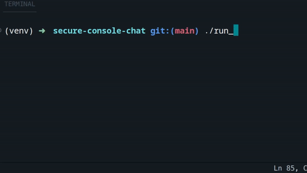

# CMD CHAT

A console chat with encrypted messaging.

## How it works

1. The client generates a private key.
2. The server generates a symmetric key.
3. The client sends its public key to the server.
4. The server encrypts the symmetric key and sends it back to the client.
5. The client encrypts the private key.
6. From then on, communication with the server happens via the symmetric key.

## Installation & Run

### Option 1: Python

```
pip install secured_console_chat
```

```python
import asyncio 
import cmd_chat

if __name__ == '__main__':
    asyncio.run(cmd_chat.run())
```

### Option 2: CLI

Start the server:

```
cmd_chat serve localhost 5000
```

Connect to the server:

```
cmd_chat connect localhost 5000 tyler
```

## Example




